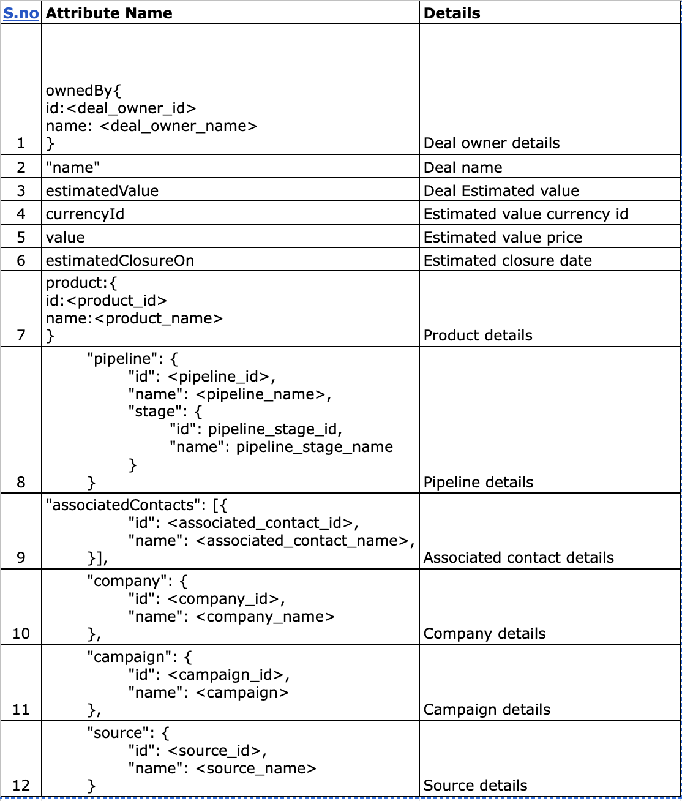

## Basic Lead request with Default fields available in Kylas APP

### Request URl: `https://api.kylas.io/v1/deals/`
### Request Type: `POST`
### Headers required: `api-key: <Users_api_key>`

### Sample headers JSON below:

`{
	'Content-Type': 'application/json',
	'api-key': <Users_api_key>
}`



### Request body in json format:

 ```{
	"ownedBy": {
		"id": 830,
		"name": "Owner_name"
	},
	"name": "Settle 2bk for 75L",
	"estimatedValue": {
		"currencyId": 431,
		"value": 7500000
	},
	"estimatedClosureOn": "2021-10-01T06:30:00.000Z",
	"product": {
		"id": 1077,
		"name": "Amrith Villas"
	},
	"pipeline": {
		"id": 1494,
		"name": "Default Deal Pipeline",
		"stage": {
			"id": 10732,
			"name": "Open"
		}
	},
	"associatedContacts": [{
		"id": 6272,
		"name": "Agent Vinod"
	}],
	"company": {
		"id": 4059,
		"name": "GK real Estates"
	},
	"campaign": {
		"id": 2131,
		"name": "Organic"
	},
	"source": {
		"id": 2132,
		"name": "Google"
	}	
}
